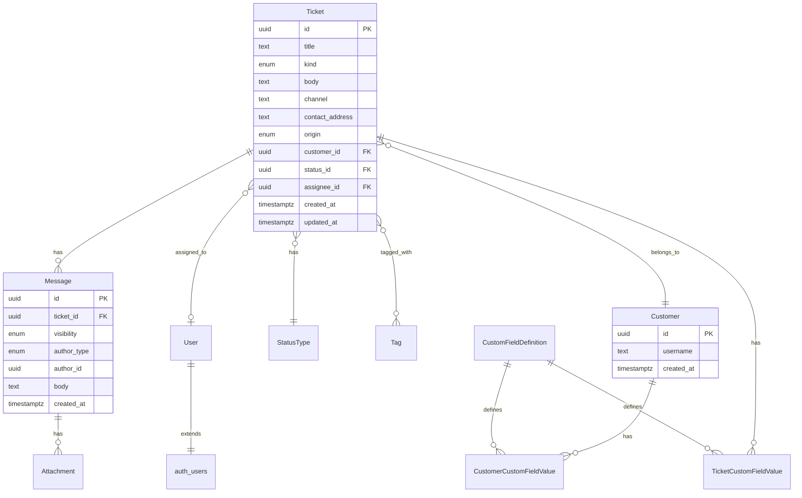

# Data Model

> Related: [API.md](./API.md) · [VISION.md](./VISION.md) · [INTEGRATIONS.md](./INTEGRATIONS.md)

## Entity relationship overview



## Core entities

### `users`

Staff accounts. Extends Supabase Auth.

| Column | Type | Notes |
|--------|------|-------|
| `id` | `uuid` PK | = `auth.users.id` |
| `username` | `text` | Display name |
| `email` | `text` | From auth |
| `role` | `enum` | `admin`, `agent` (v1) |
| `created_at` | `timestamptz` | |

**Roles (v1):**

- `admin` — full access + settings/custom field management
- `agent` — ticket CRUD, no settings changes

### `customers`

External contacts. Not auth users.

| Column | Type | Notes |
|--------|------|-------|
| `id` | `uuid` PK | |
| `username` | `text` UNIQUE | Primary identifier; typically an email |
| `created_at` | `timestamptz` | |
| `updated_at` | `timestamptz` | |

**Auto-create rule:** When a ticket is created (API or email), match customer by `username`. Create if not found. See [INTEGRATIONS.md](./INTEGRATIONS.md#customer-matching).

### `status_types`

Kanban lanes.

| Column | Type | Notes |
|--------|------|-------|
| `id` | `uuid` PK | |
| `name` | `text` | e.g. "New", "In Process", "Done" |
| `color` | `text` | Hex color for lane header + card accent |
| `position` | `int` | Lane order left → right |
| `created_at` | `timestamptz` | |

**Seed data (v1):** New · In Process · Done

### `tags`

Labels on tickets.

| Column | Type | Notes |
|--------|------|-------|
| `id` | `uuid` PK | |
| `name` | `text` UNIQUE | |
| `color` | `text` | Hex |
| `created_at` | `timestamptz` | |

### `tickets`

| Column | Type | Notes |
|--------|------|-------|
| `id` | `uuid` PK | |
| `title` | `text` | Required |
| `kind` | `enum` | `task`, `conversation` (immutable) |
| `body` | `text` | Task description only; null on conversations |
| `channel` | `text` | Plugin id (`email` v1); null on tasks |
| `contact_address` | `text` | Thread delivery address; required on conversations |
| `customer_id` | `uuid` FK → customers | Optional on tasks; required on conversations |
| `status_id` | `uuid` FK → status_types | Required; default = first status |
| `assignee_id` | `uuid` FK → users | Nullable |
| `origin` | `enum` | Ingress only: `manual`, `api`, `email` |
| `created_at` | `timestamptz` | |
| `updated_at` | `timestamptz` | |

**Task tickets** use `body` only — no rows in `messages`. **Conversation tickets** use `messages` for the thread; outbound email runs when `kind = conversation` and `channel = email`.

**Indexes:** `customer_id`, `status_id`, `assignee_id`, `kind`, `contact_address`, `created_at`, `updated_at`

### `ticket_tags`

Join table.

| Column | Type |
|--------|------|
| `ticket_id` | `uuid` FK |
| `tag_id` | `uuid` FK |

PK: (`ticket_id`, `tag_id`)

### `messages`

Conversation thread. Separate from ticket title.

| Column | Type | Notes |
|--------|------|-------|
| `id` | `uuid` PK | |
| `ticket_id` | `uuid` FK → tickets | |
| `body` | `text` | Message content (markdown or plain text — decide at implementation) |
| `visibility` | `enum` | `public`, `internal` |
| `author_type` | `enum` | `customer`, `agent`, `system` |
| `author_id` | `uuid` | FK to `customers.id` or `users.id`; null for `system` |
| `channel` | `enum` | `email`, `api`, `admin` |
| `email_message_id` | `text` | Nullable; for threading (`Message-ID` header) |
| `email_in_reply_to` | `text` | Nullable |
| `created_at` | `timestamptz` | |

**Visibility rules:**

- `public` — visible to customer (included in outbound email, copy-context)
- `internal` — agent-only notes; never sent via email

**First message:** When creating a **conversation** with an initial body, create one `messages` row. **Tasks** store description in `tickets.body` instead.

### `attachments`

Email attachments only in v1.

| Column | Type | Notes |
|--------|------|-------|
| `id` | `uuid` PK | |
| `message_id` | `uuid` FK → messages | |
| `filename` | `text` | |
| `content_type` | `text` | MIME |
| `size_bytes` | `int` | |
| `storage_path` | `text` | Supabase Storage path |
| `created_at` | `timestamptz` | |

## Custom fields

### `custom_field_definitions`

Admin-defined schema.

| Column | Type | Notes |
|--------|------|-------|
| `id` | `uuid` PK | |
| `group` | `enum` | `ticket`, `customer` |
| `key` | `text` | Machine name, e.g. `plan` |
| `label` | `text` | Display name, e.g. "Plan" |
| `type` | `enum` | See types below |
| `options` | `jsonb` | For `select`: `{ "values": ["Free", "Pro", "Unlimited"] }` |
| `required` | `boolean` | Default false |
| `position` | `int` | Display order |
| `created_at` | `timestamptz` | |

**Unique constraint:** (`group`, `key`)

**Field types (v1):**

| Type | Storage | Example |
|------|---------|---------|
| `text` | `text` | Free text |
| `number` | `numeric` | Seat count |
| `date` | `date` | Renewal date |
| `boolean` | `boolean` | VIP flag |
| `select` | `text` | Plan tier (options in `options` jsonb) |
| `url` | `text` | Dashboard link |
| `json` | `jsonb` | Structured metadata |

### `custom_field_values`

Polymorphic value storage (one row per entity + field).

| Column | Type | Notes |
|--------|------|-------|
| `id` | `uuid` PK | |
| `field_id` | `uuid` FK → custom_field_definitions | |
| `entity_type` | `enum` | `ticket`, `customer` |
| `entity_id` | `uuid` | FK to tickets or customers |
| `value_text` | `text` | For text, select, url |
| `value_number` | `numeric` | For number |
| `value_date` | `date` | For date |
| `value_boolean` | `boolean` | For boolean |
| `value_json` | `jsonb` | For json |

**Unique constraint:** (`field_id`, `entity_type`, `entity_id`)

**Query pattern:** Filter tickets by custom field via join on `custom_field_values` where `field_id = ?` and typed value column matches. See [API.md](./API.md#filtering).

## Settings

### `global_settings`

Single-row config (or key-value store). Drives admin UI.

| Key | Type | Default | Notes |
|-----|------|---------|-------|
| `visible_status_ids` | `uuid[]` | all statuses | Which lanes appear on board |
| `show_customer_on_ticket` | `boolean` | `true` | Show customer on card |
| `show_assignee_on_ticket` | `boolean` | `true` | Show assignee on card |
| `show_body_on_ticket` | `boolean` | `true` | Show first message preview |
| `visible_ticket_field_ids` | `uuid[]` | `[]` | Custom fields on card |
| `visible_customer_field_ids` | `uuid[]` | `[]` | Customer custom fields on card |

Stored as JSONB blob or normalized settings table — implementation choice.

## API keys

### `api_keys`

For external integrations and AI agents.

| Column | Type | Notes |
|--------|------|-------|
| `id` | `uuid` PK | |
| `name` | `text` | e.g. "Production agent" |
| `key_hash` | `text` | bcrypt/SHA-256 of key; never store plaintext |
| `key_prefix` | `text` | First 8 chars for identification, e.g. `tq_live_ab` |
| `created_by` | `uuid` FK → users | |
| `last_used_at` | `timestamptz` | |
| `revoked_at` | `timestamptz` | Nullable |
| `created_at` | `timestamptz` | |

## Email metadata

### `email_threads`

Maps email threading to tickets (optional normalization table).

| Column | Type | Notes |
|--------|------|-------|
| `id` | `uuid` PK | |
| `ticket_id` | `uuid` FK → tickets | |
| `root_message_id` | `text` | First `Message-ID` in thread |
| `subject` | `text` | Normalized subject (strip Re: / Fwd:) |
| `created_at` | `timestamptz` | |

Used for fallback matching when `In-Reply-To` is missing. See [INTEGRATIONS.md](./INTEGRATIONS.md#email-threading).

## Enums summary

```typescript
// Reference types — not necessarily exact TS in repo

type TicketKind = 'task' | 'conversation'
type TicketOrigin = 'manual' | 'api' | 'email'
type MessageVisibility = 'public' | 'internal'
type MessageAuthorType = 'customer' | 'agent' | 'system'
type MessageChannel = 'email' | 'api' | 'admin'
type CustomFieldGroup = 'ticket' | 'customer'
type CustomFieldType = 'text' | 'number' | 'date' | 'boolean' | 'select' | 'url' | 'json'
type UserRole = 'admin' | 'agent'
```

## RLS strategy

All tables in `public` schema with RLS enabled.

| Actor | Access |
|-------|--------|
| **Service role** (API server) | Full access — API layer enforces authorization |
| **Authenticated staff** | Read via Realtime subscriptions only (admin UI) |
| **Anon** | No access |

The admin UI does **not** write directly to Supabase. Realtime is read-only push. All mutations go through `/api/v1/*` using the service role.

## Migration notes

- Use Supabase CLI: `supabase migration new <name>`
- Seed default statuses and a default admin user in a seed script
- Custom field definitions are runtime data (created via admin), not migrations

## Future schema (not v1)

Documented here so v1 doesn't paint us into a corner:

| Feature | Schema impact |
|---------|---------------|
| Webhooks | `webhook_endpoints`, `webhook_deliveries` tables |
| Multi-tenant | `workspace_id` on all entities |
| Audit log | `audit_events` append-only table |
| SLAs | `sla_policies`, due date columns on tickets |
| Manual uploads | Same `attachments` table; new `channel` source |

See [PHASES.md](./PHASES.md) for when these land.
