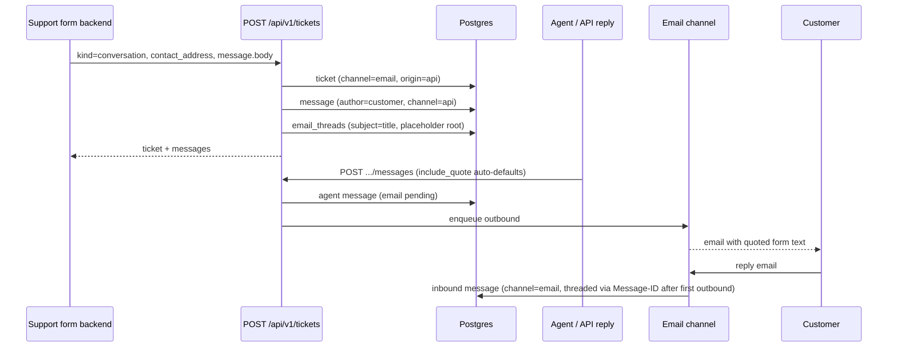

# Plan: API-originated conversation tickets

## Goal, constraints, out-of-scope

**Goal:** Allow integrators (e.g. a support form backend) to create a **conversation ticket** via `POST /api/v1/tickets` where:

1. The **first message** is a plain customer message (`channel: "api"`), not an inbound email.
2. The ticket still has a **required contact email** so agents can reply via the existing outbound email path.
3. The **first agent email reply** quotes that API-originated message in the body (standard `> ` quote block).
4. **Board and modal** show an **API** vs **Email** origin label so agents can tell how the conversation started.

**Constraints (from existing architecture):**

- Conversation tickets must satisfy DB shape: `kind = conversation`, `channel` set, `contact_address` set, `customer_id` set, `body` null on ticket row.
- Outbound email is gated by `canSendEmail()` → `kind === "conversation" && channel === "email"`.
- Auth stays as today: API key or staff JWT on `/api/v1/*`.

**Explicitly out of scope (unless you want them in a follow-up):**

- Public unauthenticated form endpoint (form server calls API with key — standard pattern).
- Auto-send acknowledgment email on ticket creation.
- Customer attachments on the initial API message.
- Idempotency / dedupe for double form submits.
- UI for *creating* API conversations from the board (API/MCP only).
- Schema migration (none needed).
- Separate customer display name on create (use customer custom fields later).

---

## Open questions (resolved)

| Question | Decision |
|----------|----------|
| Auto-reply on create? | **No** — create ticket + first message only. |
| Who calls the API? | **Backend with API key.** |
| Quoting without `include_quote: true`? | **Yes** — default quote when last customer message is `channel: "api"`. |
| Origin label in UI? | **Yes** — show **API** or **Email** based on `ticket.origin`. |

---

## Simplest viable approach (code judo)

**Reframe:** Extend the existing conversation model so the first customer message can arrive via API instead of Resend — not a separate “form ticket” subsystem.

Most of the reply pipeline already works:

- `canSendEmail()` — conversation + `channel: "email"` tickets already qualify.
- `loadAgentReplyContext()` — finds last customer message regardless of `message.channel`.
- `prepareAgentOutboundReply()` + `buildQuotedReply()` — quote when `include_quote` is true (extend with API default).

What's missing:

1. **Atomic create path** — schema currently blocks conversations via API.
2. **Quote default** for API-channel customer messages.
3. **MCP input schema** fix when `createTicketSchema` becomes a union.
4. **Origin labels** in UI (card + modal).

**The judo move:** Extend `createTicketSchema` with `kind: "conversation"`, implement in `createTicket()`, reuse existing reply/outbound paths. Ticket `channel` stays `"email"` (delivery capability); `origin: "api"` records provenance for UI and filters.



---

## Phases / PR slices

| Slice | Owns | Outcome |
|-------|------|---------|
| **PR 1 — Backend** | Schema, `createTicket`, customer message helper, quote default, MCP schema, smoke test | Form can open a conversation; first reply quotes API message |
| **PR 2 — UI labels** | Card surface + ticket modal badges | Agents see **API** vs **Email** on board and in modal |

PR 1 delivers the integrator-facing feature. PR 2 is small and can ship immediately after (or in the same PR if preferred).

---

## PR 1: Backend — create path, quoting, MCP

**Owner:** `server/services/tickets.ts`, `server/services/messages.ts`, `server/lib/validation/schemas.ts`, `server/services/outbound-replies.ts`, `server/mcp/tools.ts`, `scripts/`

### 1. Validation contract

Discriminated union on `kind`:

```typescript
// createConversationTicketSchema (new)
{
  kind: z.literal("conversation"),
  title: z.string().trim().min(1),
  contact_address: z.string().email(),  // normalized to lowercase trim in service
  message: z.object({ body: z.string().min(1) }),
  status_id?: uuid,
  assignee_id?: uuid | null,
  tags?: string[],
  custom_fields?: record,
  // NO origin field exposed — service always stores "api"
  // NO customer.username — see customer identity rule below
}

// createTicketSchema = z.discriminatedUnion("kind", [
//   createTaskTicketSchema,
//   createConversationTicketSchema,
// ])
```

**Invariants:**

- `contact_address` → `trim().toLowerCase()` before insert (match `email-inbound.ts`).
- `origin` is **always `"api"`** for conversation creates — not client-supplied. Task creates keep default `"manual"`.
- `status_id` defaults to `getInboundEmailStatusId()` (parity with inbound email).

### 2. Customer identity (load-bearing)

Inbound email uses `findOrCreateCustomer(parsed.from)` and subject fallback in `findTicketBySubjectAndContact` matches on **`customer_id`**.

**Rule:** API conversation create must call `findOrCreateCustomer(normalizedContactAddress)` — same normalized email string used for `contact_address`. Do **not** expose a separate `customer.username` on v1 create; diverging username/email breaks pre-outbound inbound subject matching.

If a customer already exists under a different username casing, prefer lookup by normalized email before insert (or always use normalized email as username). Align with however `findOrCreateCustomer` is called from `processInboundEmail`.

### 3. Service: `createConversationTicket()` (called from `createTicket`)

1. Normalize `contact_address`.
2. **`assertChannelFields("email", "on_create", { contact_address })`** — same gate as inbound.
3. **`findOrCreateCustomer(normalizedContactAddress)`**.
4. **Insert ticket:** `kind: conversation`, `channel: "email"`, `contact_address`, `customer_id`, `title`, `body: null`, `origin: "api"`.
5. **Insert first customer message** — `authorType: customer`, `channel: "api"`, no email headers.
6. **`ensureEmailThread(ticketId, title)`** — placeholder root Message-ID.
7. Tags / custom fields.
8. **`return getTicket(id)`**.

**Email threading — accurate semantics:**

- `ensureEmailThread` at create enables **subject + contact/customer fallback** matching (`findTicketBySubjectAndContact`) if the customer emails back **before** any agent outbound send.
- **Message-ID header threading** (`findTicketByMessageHeaders`) only works after at least one message has `email_message_id` — i.e. after the first outbound email sends and `sendOutboundEmailForMessage` updates the thread root. Do not claim pre-outbound header matching.

**Failure cleanup:** Best-effort delete ticket if message/thread insert fails. No prod DB yet — no migration/rollback concerns; keep cleanup simple (delete ticket row; cascades handle messages/tags/threads). Set custom fields only after message succeeds to avoid orphan `custom_field_values`.

### 4. Message helper

Add shared `createCustomerMessage()` used by both API create and inbound email. Keep `createInboundCustomerMessage` as a thin wrapper.

| Field | API-originated | Email-originated |
|-------|----------------|------------------|
| `channel` | `"api"` | `"email"` |
| Email headers | null | populated |

### 5. Quote default (same PR — core behavior)

In `prepareAgentOutboundReply`:

```
effectiveIncludeQuote =
  input.email?.include_quote ??
  (lastCustomerMessage?.channel === "api")
```

- Explicit `include_quote: false` wins.
- Email-thread replies: unchanged when undefined (no quote unless UI/API sets true).
- Applies to direct sends and draft sends (both call `prepareAgentOutboundReply`).

### 6. MCP tool schema (required)

`server/mcp/tools.ts` currently uses `inputSchema: createTicketSchema.shape`. A `z.discriminatedUnion(...)` has **no `.shape`** — MCP registration will break.

**Fix:** Export explicit MCP input, e.g.:

```typescript
export const createTicketMcpInputSchema = z.object({
  ...createTaskTicketSchema.shape,   // or union-friendly oneOf in tool descriptor
  // OR: z.union([createTaskTicketSchema, createConversationTicketSchema])
});
```

Update `ticqex_create_ticket` to use the MCP-safe schema and refresh description: *"Create a task ticket or an API-originated conversation ticket."*

### 7. Wire existing surfaces

- `POST /api/v1/tickets` — no route change.
- `CreateTicketInput` type follows schema union.

### 8. Smoke script: `scripts/test-api-conversation.ts`

1. `POST /api/v1/tickets` with conversation payload.
2. Assert `kind`, `channel: "email"`, `origin: "api"`, `contact_address`, one customer message with `channel: "api"`.
3. `POST /api/v1/tickets/:id/messages` with agent body — **omit** `include_quote`.
4. Assert message body contains quoted form text (`On … wrote:` + `> ` lines).
5. Assert `email_delivery_status: "pending"` when email channel operational.
6. Wire as `pnpm test:api-conversation`.

---

## PR 2: UI — API / Email origin labels

**Owner:** `shared/channels/email/card.ts`, `shared/channels/card-surface.ts` (if context needs `origin`), `src/components/board/ticket-modal.tsx`

Conversation tickets always have `channel: "email"` (delivery). **Origin** distinguishes how they started.

### 1. Board card badge

Today `shared/channels/email/card.ts` always emits `{ label: "Email" }`.

**Change:** Pass `origin` into `ChannelCardTicketContext` / `buildTicketCardSurface` and set badge label:

| `origin` | Card badge |
|----------|------------|
| `"api"` | **API** |
| `"email"` | **Email** |
| other | **Email** (fallback for manual/test data) |

Update call sites: `formatTicketListItem`, `enrichTicketsForBoard` — include `origin` in card surface context.

### 2. Ticket modal header

Today modal shows a single **Email conversation** badge for all `kind === "conversation"`.

**Change:** Replace or supplement with origin-specific label:

- `origin === "api"` → **API** badge (e.g. `variant="outline"`)
- `origin === "email"` → **Email** badge (e.g. `variant="secondary"`)

Keep status combobox and rest of header unchanged. Message thread rendering stays as-is (`EmailMessageHeader` already shows per-message **Message** vs **Email**).

### 3. No other UI work

- No board create flow for API conversations.
- No compose/subject changes beyond existing fallbacks (`formatReplySubject(null, ticket.title)` → `Re: {title}`).

---

## Decisions (resolved)

| Decision | Choice | Rationale |
|----------|--------|-----------|
| Ticket `channel` | `"email"` | Reuses `canSendEmail`, outbound handler, field policies |
| First message `channel` | `"api"` | Truthful provenance |
| Provenance field | `origin: "api"` (server-set) | UI labels + filters; not client-controlled |
| Customer record | `findOrCreateCustomer(normalizedContactAddress)` | Matches inbound threading fallback |
| Email thread at create | `ensureEmailThread(title)` | Subject/customer fallback before first outbound |
| Status on create | `getInboundEmailStatusId()` | Same lane as inbound email |
| Quote default | In PR 1 | Part of core promise, not a polish slice |
| MCP schema | Dedicated export | Union breaks `.shape` |

---

## Example API usage

**Create:**

```http
POST /api/v1/tickets
Authorization: Bearer tq_live_...

{
  "kind": "conversation",
  "title": "Help with billing",
  "contact_address": "user@example.com",
  "message": {
    "body": "I was charged twice for my subscription."
  }
}
```

**Reply:**

```http
POST /api/v1/tickets/{id}/messages

{
  "body": "Thanks for reaching out — we're looking into this.",
  "channel": "api"
}
```

Quoting is automatic for API-channel customer messages. Email sends via existing enqueue path when channel is operational.

---

## Rollout / rollback

- **Rollout:** PR 1 (backend + smoke test) → PR 2 (UI labels). Can combine if review prefers one PR.
- **Rollback:** Revert schema branch; task creates and email-inbound conversations unaffected.
- **No prod DB** — no migration rollback needed; best-effort create cleanup is sufficient.

---

## Test and verification checklist

| Outcome | How to verify |
|---------|----------------|
| Conversation create via API | `pnpm test:api-conversation` + curl with API key |
| `origin` always `"api"` | Assert response; reject/constrain if client sends other origin |
| Customer matches inbound identity | Same email inbound later → threads to same ticket (subject fallback) |
| Board card shows **API** badge | Create via API; open board |
| Modal shows **API** badge | Open ticket modal |
| Email-origin tickets show **Email** | Existing inbound ticket unchanged |
| First reply quotes form text | Smoke script; omit `include_quote` |
| Agent reply sends email | `email_delivery_status` → `sent` when operational |
| Customer reply after outbound | Message-ID threading via `findTicketByMessageHeaders` |
| Task create unchanged | Board create with `kind: "task"` |
| MCP tool | `ticqex_create_ticket` with conversation payload |

---

## Approval bar check

- Goal and out-of-scope explicit; origin UI requirement included.
- Code judo: extend existing paths; no parallel subsystem.
- Load-bearing decisions documented (customer identity, threading semantics, MCP schema, origin lock).
- PR 1 ≤ 8 concrete backend steps; PR 2 is 3 UI steps.
- Quote default in PR 1 (not deferred).
- Cleanup scoped appropriately for pre-prod.

---

**Recommended next step:** Implement PR 1, then PR 2 (or both together). Optional follow-up: auto-reply on create via extra payload field — not required for support-form MVP.
